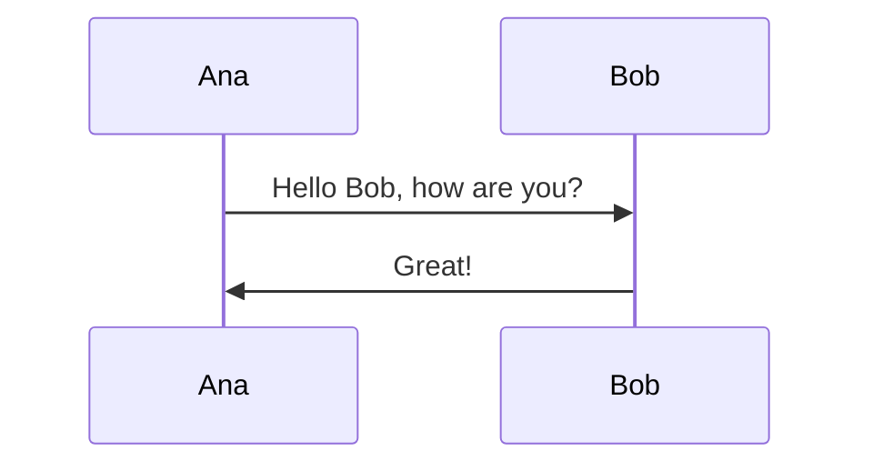

# 0.1.1 - Sequence Diagram

This is an example of how to draw a squence diagram using markdown, Typora app and Mermaid.

```mermaid
sequenceDiagram
	participant A as Ana
	participant B as Bob
	A->>B: Hello Bob, how are you?
	B->>A: Great!
```

