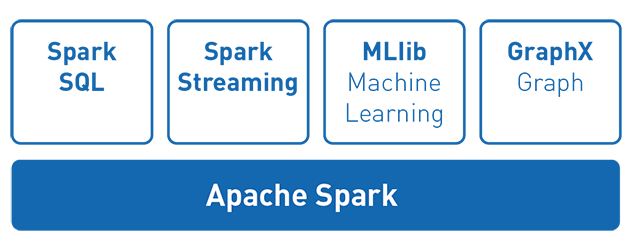
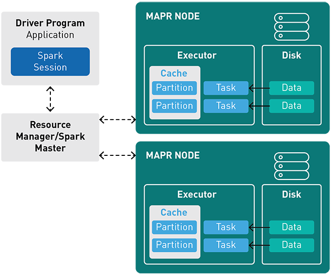

# Apache Spark

- Es un motor para el procesamiento de datos de propósito general.
- Arriba del core de Apache Spark existen algunas librerías
- Spark usa la memoria, lo que evita leer y escribir a un disco (como lo hace Apache MapReduce) lo cual es costoso.
- Puede ser usado en:
  - Streaming Data
    Con la basta cantidad de datos a ser procesada día a día, es esencial poder transmitir (stream) y analizar todo en tiempo real. Esta siendo usado de la siguientes maneras:
    - Streaming ETL
    - Data enrichment
    - Trigger event detection
    - Complex session analysis
  - Machine Learning
  - Interactive Analysis
  - Fog Computing
- Soporta los siguientes resource/cluster managers
  - Spark Standalone
  - Apache Mesos
  - Apache Hadoop YARN
  - Kubernetes
- Es usado con frecuencia con almacenes distribuidos de datos tales como MapR XD, Hadoop´s HDFS, y Amazon's S3, con NoSQL databases tales como MapR Database, Apache HBase, Apache Cassandra, y MondogoDB y, con almacenes de mensajería distribuida tales como MapR Event Store y Apache Kafka.
- Diagrama de una aplicación corriendo en un cluster
- Spark presenta en concept de un RDD (Resilient Distributed Dataset) [ver más](http://spark.apache.org/docs/1.2.1/programming-guide.html#resilient-distributed-datasets-rdds)
- 

### References

- Top Apache  Spark Use Cases [ver](https://www.qubole.com/blog/apache-spark-use-cases/)
- Spark 101: What is it, What it does, and  Why it Matters [ver](https://mapr.com/blog/spark-101-what-it-what-it-does-and-why-it-matters/)
- Introduction to Apache Spark with Examples and Use case [ver](https://www.toptal.com/spark/introduction-to-apache-spark)
- 